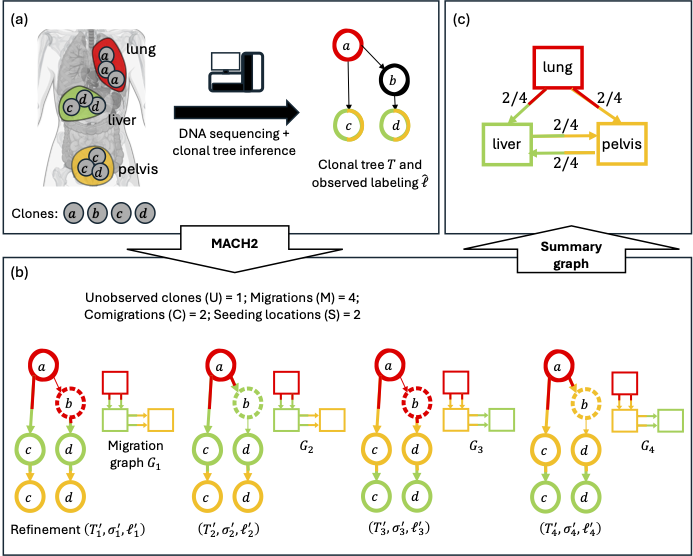

# MACH2

MACH2 is a computational tool for inferring optimal migration histories of metastatic cancer from clonal trees and observed clone locations. It supports multiple parsimony criteria, including the *unobserved clone criterion*, and guarantees optimality and completeness by systematically enumerating solutions.  

Preprint: [bioRxiv](https://www.biorxiv.org/content/10.1101/2024.11.19.624301v2).  

For the accompanying visualization tool, see [MACH2-viz](https://github.com/elkebir-group/mach2-viz).  

## Table of contents

1. [Installation](#1-installation)  
        1.1 [Prerequisite](#11-prerequisite)  
        1.2 [Install using `pip`](#12-install-using-pip)  
        1.3 [Install using `conda`](#13-install-using-conda)  
        1.4 [Install from source](#14-install-from-source)  
2. [Usage instruction](#2-usage-instruction)  
        2.1 [I/O formats](#21-io-formats)  
        2.2 [Usage](#22-usage)  
                2.2.1 [From `JupyterLab`](#221-from-jupyterlab)  
                2.2.2 [From Terminal](#222-from-terminal)  
3. [Reproduction](#3-reproduction)  

## 1. Installation

### 1.1 Prerequisites

- **Python** - `MACH2` requires Python 3.12 or newer.
- **ILP solver** - `MACH2` requires an ILP solver installed. Currently `MACH2` only supports `Gurobi optimizer` (version 12 or newer), but we are going to add support for more ILP solvers in the future. `MACH2` requires a valid Gurobi installation and license key. The location of Gurobi should be present in `LD_LIBRARY_PATH` (linux) or `DYLD_LIBRARY_PATH` (macOS), and the license key should be saved in the environment variable `GRB_LICENSE_KEY`.
- **OS** - Since MACH2 is a pure Python package, it can be run on any operating system that supports Python.

MACH2 has been tested with Python 3.12 and Gurobi optimizer version 12 on CentOS 7.

### 1.2 Install using `pip`

`MACH2` can easily be installed using `pip`, the package installer for Python. Open a terminal or command prompt and run the following command:

                $ pip install mach2

If you want to install `MACH2-viz` along with `MACH2`, you can run the following command instead:

                $ pip install 'mach2[viz]' 

`MACH2-viz` can be installed separately too.

### 1.3 Install using `conda`

`MACH2` can be installed using `conda`. We advise to create a new environment in `conda`. If creating a new environment, dependencies can be installed simultaneously.

                $ conda create -n mach2 python=3.12 pandas networkx gurobi jupyterlab graphviz pygraphviz -c conda-forge -c gurobi
                $ conda activate mach2

If using existing conda environment, the following command installs the dependencies.

                $ conda install -c conda-forge -c gurobi pandas networkx gurobi jupyterlab graphviz pygraphviz

Next, we install `MACH2`. To that end, we download `MACH2` repository from GitHub and install it.

                $ git clone https://github.com/elkebir-group/MACH2.git
                $ cd MACH2
                $ pip install . --no-deps

### 1.4 Install from source

Since MACH2 is a python package, one may clone the repository and install from source using `pip`.

                $ git clone https://github.com/elkebir-group/MACH2.git
                $ cd MACH2
                $ pip install .

In any approach, MACH2 takes less than 5 minutes to install on a normal computer with regular internet speed.

## 2. Usage Instruction

### 2.1 I/O formats

We describe various formats used by `MACH2`.

1. **Tree file** : The tree file contains a list of edges that define the structure of a tree. Each line in the file represents an edge, and the edges should be in the format: `node1 node2`. For example:

        1   2
        2   3
        2   4 
        3   5

2. **Tree file with timing/comigrations** : Tree file with timestamps. Edges with the same timestamp belong to the same comigration, and a timestamp with `-1` represents non-migration. Each line corresponds to an edge in the format: `node1 node2 timestamp`. For example:

        1   2   -1
        2   3   1
        2   4   1
        3   5   2

3. **Observed labeling file** : The observed labeling file contains zero or more location labels assigned to each node of the input clonal tree. Each line in the file corresponds to a node and the labels assigned to it in the format: `node label1 label2 ...`. If a node is not observed anywhere, it may be skipped. For example:

        1   A   B
        3   B
        4   A   C
        5   C

4. **Location labeling file** : The location labeling file contains the unique location label of origin assigned to each node. Each line in the file corresponds to a node and the location label of origin are in the format: `node label`. For example:

        1   A
        2   B
        3   C

5. **Node of origin file** : The node of origin file maps the nodes of the refined tree to the nodes of the input clonal tree. Each line in the file corresponds to a vertex and the labels are in the format: `leaf label`. For example:

        1   A
        2   B
        3   C
        
Additionaly, `MACH2` can output files in Graphviz DOT format or JSON format.

### 2.2 Usage

`MACH2` takes as input two files - 

1. **Tree file** : Tree file describing the input clone tree.
2. **Observed labeling file** : Labeling file describing the observed labeling of input clone tree.

`MACH2` Can be run using command line, or can be directly accessed from `JupyterLab`.

#### 2.2.1 From JupyterLab

`MACH2` can be directly imported and accessed from JupyterLab. 
We include an [example JupyterLab notebook][https://github.com/elkebir-group/MACH2/blob/main/analysis/example.ipynb] to illustrate basic usage.
The notebook runs in less than one minute on a normal computer.
For more details, check the documentation for classes and methods.

#### 2.2.2 From Terminal

For each solution, `MACH2` can output three types of files.

1. **Tree file with timing/comigrations** : Refined tree file with timestamps/comigrations.
2. **Location labeling file** : Location labeling file describing the location labeling of the refined tree.
3. **Node of origin file** : Node of origin file mapping refined tree nodes to input clonal tree nodes.

Additionaly `MACH2` can return JSON file encoding all the solutions. The JSON file can be directly passed to [MACH2-viz](https://github.com/elkebir-group/mach2-viz). The exact format of the JSON file is described [here](https://github.com/elkebir-group/mach2-viz/README.md).

`MACH2` also prints `<primary location> <number of migrations> <number of comigrations> Optimal <running time (in seconds)>` on console.

`MACH2` can be run using python.

                usage: mach2 [-h] [-c CRITERIA] [-p PRIMARY] [--colormap COLORMAP] [--log] [-o OUTPUT] [--starting_nsols STARTING_NSOLS]
                             [--max_solutions MAX_SOLUTIONS] [-t THREADS] [--viz]
                             clonal_tree observed_labeling

                MACH2

                positional arguments:
                        clonal_tree           Input clonal tree
                        observed_labeling     Input observed labeling

                options:
                        -h, --help            show this help message and exit
                        -c CRITERIA, --criteria CRITERIA
                                                Criteria ordering
                        -p PRIMARY, --primary PRIMARY
                                                Primary anatomical location
                        --colormap COLORMAP   Color map file
                        --log                 Outputs Gurobi logging (default=False)
                        -o OUTPUT, --output OUTPUT
                                                Output folder (default=current folder)
                        --starting_nsols STARTING_NSOLS
                                                Starting number of solutions (default=37)
                        --max_solutions MAX_SOLUTIONS
                                                Maximum number of solutions retained (default=37888)
                        -t THREADS, --threads THREADS
                                                Number of threads
                        --viz, --open_in_viz  Open the locations on MACH2-viz (default=False)

An example execution

        $ mach2 data/breast/A1.tree data/breast/A1.observed.labeling -p breast --colormap data/breast/coloring.txt
        
For this specific instance, MACH2 takes less than one second to run on a normal computer.

## 3. Reproduction

We include a [JupyterLab notebook](https://github.com/elkebir-group/MACH2/blob/main/analysis/run.ipynb) containing relevant codes to run MACH2 (and also the other migration history inference methods) on all the simulated and real data and generate the results presented in the preprint.